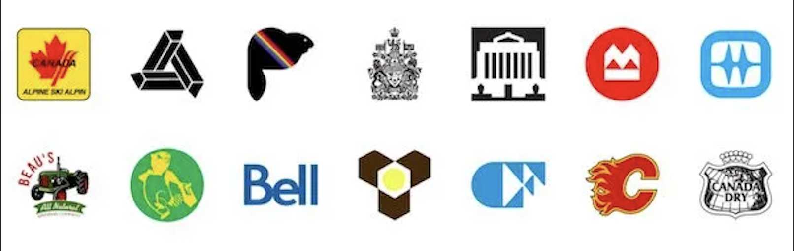

<p align="center">
  <a href="https://github.com/dhyan1999/Hate_Speech_Detection" title="Hate Speech Detection">
  </a>
</p>
<h1 align="center"> Logo Detection from bills(pdf) using YoloV4 and DarkNet </h1>




Abstract : <p > This project aims to develop a logo detection system that can accurately detect and localize logos from bills of telecommunication companies using the Darknet framework and YOLOv4 (You Only Look Once) algorithm. The system will leverage state-of-the-art object detection techniques to automate the process of logo detection from telecommunication bills, making it faster and more efficient.

Key Features:

- Data Collection and Preparation: A dataset of telecommunication bills with annotated logo regions will be collected or created. The dataset will be carefully curated and annotated to provide accurate training data for the logo detection model.

- Darknet Framework: The Darknet framework, a popular open-source deep learning framework, will be utilized as the foundation for implementing the logo detection system. Darknet provides a flexible and efficient platform for training and deploying deep neural networks.

- YOLOv4 Model: YOLOv4, a state-of-the-art real-time object detection algorithm, will be employed to detect and localize logos within the telecommunication bills. YOLOv4 offers superior accuracy and speed compared to other object detection algorithms.

- Model Training: The YOLOv4 model will be trained on the annotated dataset to learn the visual features and patterns associated with telecommunication company logos. The training process will involve optimizing the network's parameters to achieve high accuracy in logo detection.

- Logo Recognition: Once the logos are detected and localized, the system will include an additional component for logo recognition. This step may involve employing a separate classifier or implementing a recognition algorithm to identify and associate each logo with the corresponding telecommunication company.

- Evaluation and Fine-tuning: The trained logo detection model will be evaluated using appropriate evaluation metrics to assess its performance. Fine-tuning techniques may be employed to further improve the accuracy and robustness of the system.</p>

<h2 align="center">🌐 Links 🌐</h2>
<p align="center">
    <a href="https://github.com/dhyan1999/Hate_Speech_Detection" title="Helmet Detection">📂 Repo</a>
    ·
    <a href="https://github.com/dhyan1999/Hate_Speech_Detection/blob/main/Report/Hate_Speech_Detection.pdf" title="Helmet Detection">📄 Paper</a>
    
</p>


## Table of Content

1. [Manifest](#-manifest)
2. [Prerequisites](#-prerequisites)
3. [Data-Set](#data-set)
4. [Implementation of Code](#-implementation-of-code)
5. [Results](#results)
## 🧑🏻‍🏫 Manifest


```
- Code - Contains all parts of code in a sequential manner
- Dataset - Dataset that we have used in our project (Augmented Dataset as well)
- Presentation - Final Presentation
- Report - IEEE Paper for the project
```


## 🤔 Prerequisites

- [Python](https://www.python.org/ "Python") Installed

- Advance Python Understanding

- Tensor-flow and Keras Installed

- Understanding of labelImg and Darknet

- Understanding of Machine Learning and Deep Learning libraries

- OpenCV Library Installed

- Computer Vision Basic Understanding

## Data-Set

- Collection of minimum 50-60 pdf of same company and number of companies depend upon your need

## 👨🏻‍💻 Implementation of Code

BERT Contextual Embedding
- We assume an invariance that sentences are natural even if the words in the sentences are replaced with other words with paradigmatic relations.
- At the word places, we stochastically swap out words with others that a bidirectional language model predicts. There are many context-sensitive terms, but they are all acceptable for enhancing the original language


```py
import nlpaug.augmenter.word.context_word_embs as aug
augmenter = aug.ContextualWordEmbsAug(model_path='bert-base-uncased', action="insert")
def augmentMyData(df, augmenter, repetitions=1, samples=200):
    augmented_texts = []
    # select only the minority class samples
    spam_df = df[df['label'] == 1].reset_index(drop=True) # removes unecessary index column
    for i in tqdm(np.random.randint(0, len(spam_df), samples)):
        # generating 'n_samples' augmented texts
        for _ in range(repetitions):
            augmented_text = augmenter.augment(str(spam_df['Text'].iloc[i]))
            augmented_texts.append(augmented_text)
    
    data = {
        'label': 1,
        'Text': augmented_texts
    }
    aug_df = pd.DataFrame(data)
    df = shuffle(df.append(aug_df).reset_index(drop=True))
    return df
```


## Results


The original dataset has only 12.01% of hate speech data. However, We increased the minority class until the threshold point (50%), using Bert contextual embeddings. The Fig.12 represents the graphical representation of the classification report.

<div>
    <a href="https://plotly.com/~dhyan1999/1/" target="_blank" title="Final Bert Augmentation Output" style="display: block; text-align: center;"></a>
</div>

According to our research comparing various model types, word embedding techniques, and augmentation approaches, we have come to the conclusion that augmentation is a critical element of an unbalanced dataset to get a better F1 score. BERT contextual embedding is highly helpful for text augmentation in our scenario since it doesn’t alter the sentence’s main idea; rather, it only adds supporting words. Our tests reveal that the combination of TD-IDF + BERT Contextual Embedding + Random Forest provides the greatest F1-Score, Recall, and accuracy.

## 🧑🏻 Author

**Dhyan Shah**

- 🌌 [Profile](https://github.com/dhyan1999 "Dhyan Shah")

- 🏮 [Email](mailto:dhyan.shah99@gmail.com?subject=Hi%20from%20Dhyan%20Shah "Hi!")

<p align="center">Made with Python & ❤️ in India</p>