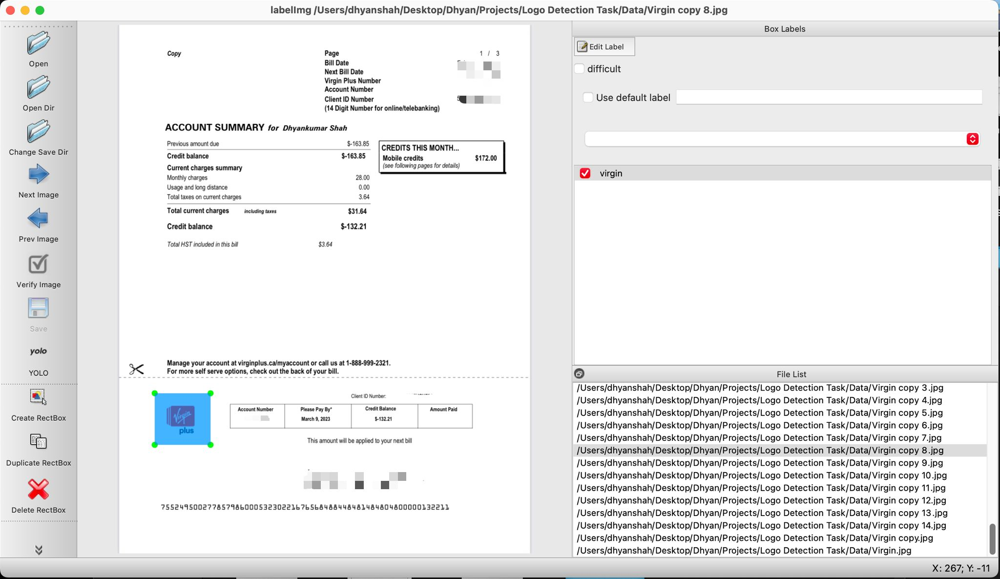
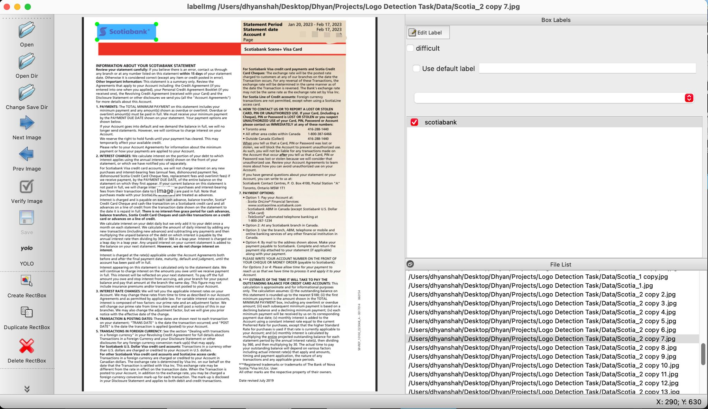
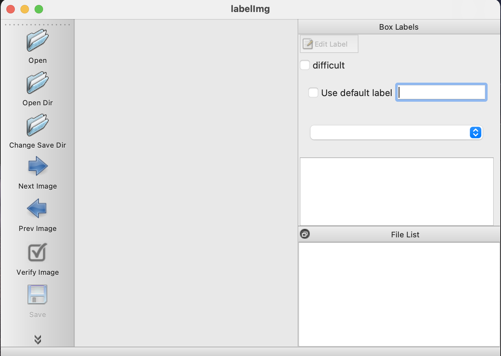
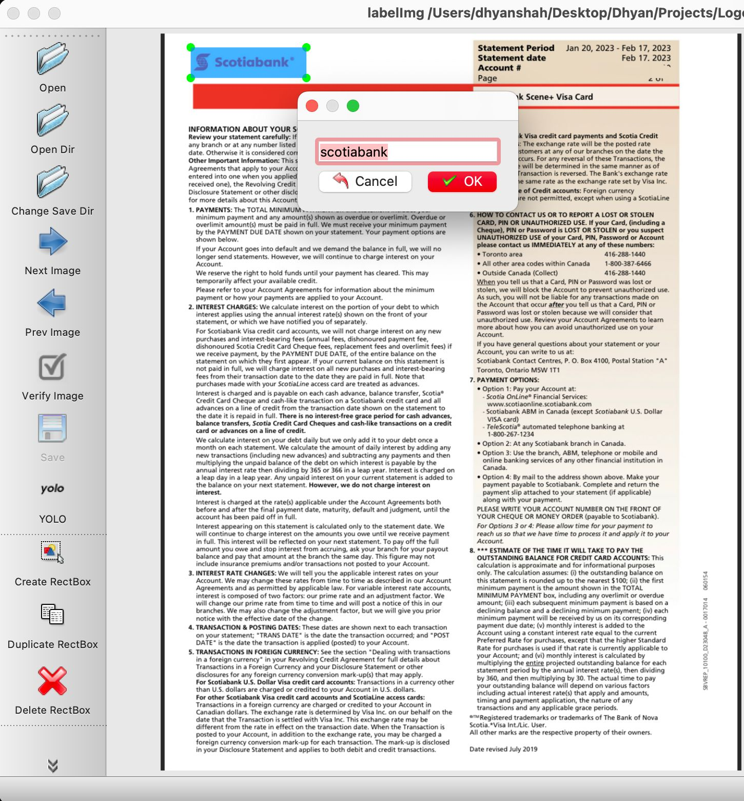
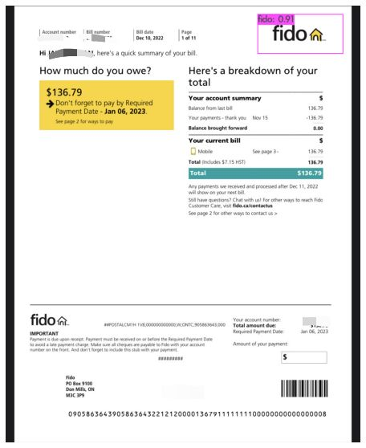
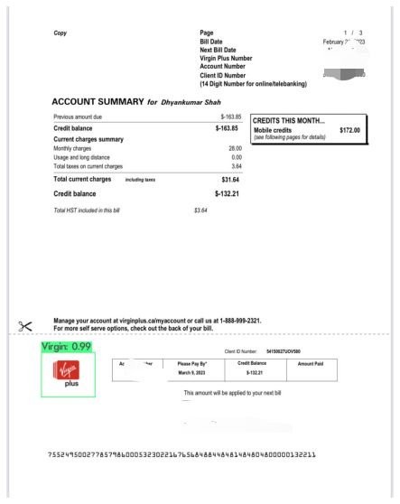
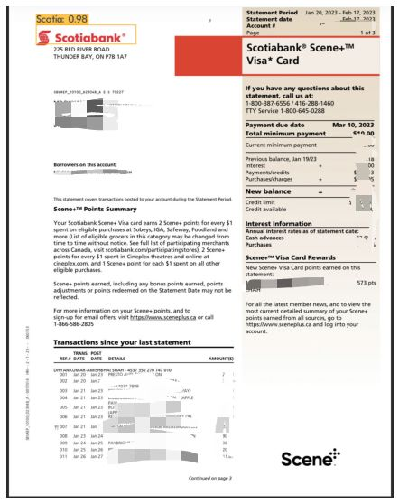

<p align="center">
  <a href="https://github.com/dhyan1999/Hate_Speech_Detection" title="Hate Speech Detection">
  </a>
</p>
<h1 align="center"> Logo Detection from bills(pdf) using YoloV4 and DarkNet </h1>


Abstract : <p > This project aims to develop a logo detection system that can accurately detect and localize logos from bills of telecommunication companies using the Darknet framework and YOLOv4 (You Only Look Once) algorithm. The system will leverage state-of-the-art object detection techniques to automate the process of logo detection from telecommunication bills, making it faster and more efficient.

Key Features:

- Data Collection and Preparation: A dataset of telecommunication bills with annotated logo regions will be collected or created. The dataset will be carefully curated and annotated to provide accurate training data for the logo detection model.

- Darknet Framework: The Darknet framework, a popular open-source deep learning framework, will be utilized as the foundation for implementing the logo detection system. Darknet provides a flexible and efficient platform for training and deploying deep neural networks.

- YOLOv4 Model: YOLOv4, a state-of-the-art real-time object detection algorithm, will be employed to detect and localize logos within the telecommunication bills. YOLOv4 offers superior accuracy and speed compared to other object detection algorithms.

- Model Training: The YOLOv4 model will be trained on the annotated dataset to learn the visual features and patterns associated with telecommunication company logos. The training process will involve optimizing the network's parameters to achieve high accuracy in logo detection.

- Logo Recognition: Once the logos are detected and localized, the system will include an additional component for logo recognition. This step may involve employing a separate classifier or implementing a recognition algorithm to identify and associate each logo with the corresponding telecommunication company.

- Evaluation and Fine-tuning: The trained logo detection model will be evaluated using appropriate evaluation metrics to assess its performance. Fine-tuning techniques may be employed to further improve the accuracy and robustness of the system.</p>

<h2 align="center">🌐 Links 🌐</h2>
<p align="center">
    <a href="https://github.com/dhyan1999/Hate_Speech_Detection" title="Helmet Detection">📂 Repo</a>
    ·
    <a href="https://github.com/dhyan1999/Hate_Speech_Detection/blob/main/Report/Hate_Speech_Detection.pdf" title="Helmet Detection">📄 Paper</a>
    
</p>


## Table of Content

1. [Manifest](#-manifest)
2. [Prerequisites](#-prerequisites)
3. [Data-Set](#data-set)
4. [Implementation of Code](#-implementation-of-code)
5. [Results](#results)
## 🧑🏻‍🏫 Manifest


```
- Code - Contains all parts of code in a sequential manner
- Dataset - Dataset that we have used in our project (Augmented Dataset as well)
- Presentation - Final Presentation
- Report - IEEE Paper for the project
```


## 🤔 Prerequisites

- [Python](https://www.python.org/ "Python") Installed

- Advance Python Understanding

- Tensor-flow and Keras Installed

- Understanding of labelImg and Darknet

- Understanding of Machine Learning and Deep Learning libraries

- OpenCV Library Installed

- Computer Vision Basic Understanding

## Data-Set

- Collection of minimum 50-60 pdf of same company and number of companies depend upon your need

- Here i have used my Scoiabank, Fido and Virgin bills (eg show below)




**🎇 You are Ready to Go!**

## ❗ Installation of Important Libraries

Before running the .ipynb file we need to import some of the libraries using terminal 

In the Anaconda Terminal, you can run:

```Bash
pip install opencv-python
```

For installing TKinter (If it shows the error that Tkinter is not installed)

```Bash
pip install python-tk
```

## Installation of labelImg

- LabelImg - LabelImg is a free, open source tool for graphically labeling images. It’s written in Python and uses QT for its graphical interface. It’s an easy, free way to label a few hundred images 

- Open Anaconda Terminal and write run command

```Bash
sudo pip3 install labelimg
```


## Use of labelImg in the project 

- Step1 - Write the command labelImg in the Anaconda Terminal which will open a window as shown below.

```Bash
labelimg
```



- Step2

- Load all the images from the directory and mark all the images by their respective classes



- You will get a classes.txt file after labeling all the images of dataset

##  Important topics used in the Project

Darknet

- Darknet is an open-source neural network framework known for implementing the YOLO algorithm. It enables efficient training and deployment of deep neural networks for object detection tasks, such as logo detection. Darknet's flexibility allows customization of network architectures and training configurations. It supports real-time processing and offers tools for data augmentation. By using Darknet with YOLOv4, the logo detection system achieves accurate and efficient detection and localization of telecommunication company logos from bills.

YoloV4

- YOLOv4 pretrained weights are pre-learned parameters of a YOLOv4 model. They capture the knowledge gained from training on a large dataset, including logo detection. These weights serve as a starting point for fine-tuning or transfer learning. By utilizing pretrained weights, developers can accelerate the training process and benefit from the model's ability to detect logos and other objects. Fine-tuning on specific data further refines the model's performance for logo detection on telecommunication bills.

## 👨🏻‍💻 Implementation of Code


```py
%%capture
!git clone https://github.com/AlexeyAB/darknet.git
%cd darknet
import re
!sed -i 's/OPENCV=0/OPENCV=1/' Makefile
!sed -i 's/GPU=0/GPU=1/' Makefile
!sed -i 's/CUDNN=0/CUDNN=1/' Makefile
!sed -i 's/CUDNN_HALF=0/CUDNN_HALF=1/' Makefile
!make
!chmod +x ./darknet
```

```py
#utility function
def imShow(path):
  import cv2
  import matplotlib.pyplot as plt
  %matplotlib inline

  image = cv2.imread(path)
  height, width = image.shape[:2]
  resized_image = cv2.resize(image,(3*width, 3*height), interpolation = cv2.INTER_CUBIC)

  fig = plt.gcf()
  fig.set_size_inches(18, 10)
  plt.axis("off")
  #plt.rcParams['figure.figsize'] = [10, 5]
  plt.imshow(cv2.cvtColor(resized_image, cv2.COLOR_BGR2RGB))
  plt.show()
  
```

```py
repo_url = 'https://github.com/GotG/yolotinyv3_medmask_demo'
import os
%cd /content
repo_dir_path = os.path.abspath(os.path.join('.', os.path.basename(repo_url)))
!git clone {repo_url}
%cd {repo_dir_path}
```

```py
labels_path = '/content/yolotinyv3_medmask_demo/obj.names'
#make a list of your labels
labels = ['fido','Scotia','Virgin']
with open(labels_path, 'w') as f:

    f.write('\n'.join(labels))

#check that the labels file is correct
!cat /content/yolotinyv3_medmask_demo/obj.names
```

```py
import re
objdata = '/content/yolotinyv3_medmask_demo/obj.data'
with open(objdata) as f:
    s = f.read()

#the number of classes is equal to the number of labels
num_classes = len(labels)   
s = re.sub('classes= \d*','classes = ' + str(num_classes),s)
with open(objdata, 'w') as f:
  f.write(s)
!cat /content/yolotinyv3_medmask_demo/obj.data
```

```py
%cd ../yolotinyv3_medmask_demo/
%cd /content/yolotinyv3_medmask_demo/obj
%rm *
%cd /content/darknet
%rm *
```

```py
# set the number of max_batches - min 2000 per class:
max_batch=2500
# calculate the 2 steps values:
step1 = 0.4 * max_batch
step2 = 0.7 * max_batch
step3 = 0.9 * max_batch
#subdivisions define the minibatch size: minibatch = batch/subdivisions
#we set subdivisions to 4. if using larger resolutions, may have to increase
#the this number to 8 16 or even 32. default resolution is 416x416
subdivisions = 4


# we also need to adjust the number of classes and a parameter called filter size 
# that are both is inside the model structure

# num_classes = len(labels)
num_filters = (num_classes + 5) * 3

cfg_file = '/content/yolotinyv3_medmask_demo/yolov4-tiny.cfg'

with open(cfg_file) as f:
    s = f.read()
# (re.sub('[a-z]*@', 'ABC@', s))
s = re.sub('subdivisions=\d*','subdivisions='+str(subdivisions),s)
s = re.sub('max_batches = \d*','max_batches = '+str(max_batch),s)
s = re.sub('steps=\d*,\d*','steps='+"{:.0f}".format(step1)+','+"{:.0f}".format(step2)+','+"{:.0f}".format(step3),s)
s = re.sub('classes=\d*','classes='+str(num_classes),s)
s = re.sub('pad=1\nfilters=\d*','pad=1\nfilters='+"{:.0f}".format(num_filters),s)
# pad=1\nfilters=\d\d
# s = re.sub('CUDNN=0','CUDNN=1',s)
# s = re.sub('OPENCV=0','OPENCV=1',s)

with open(cfg_file, 'w') as f:
  # s = re.sub('GPU=0','GPU=1',s)
  f.write(s)

```

```py
!./darknet detector train /content/yolotinyv3_medmask_demo/obj.data /content/yolotinyv3_medmask_demo/yolov4-tiny.cfg /content/yolotinyv3_medmask_demo/yolov4-tiny.conv.29 -dont_show -ext_output -map
```

```py
!./darknet detector map /content/yolotinyv3_medmask_demo/obj.data /content/yolotinyv3_medmask_demo/yolov4-tiny.cfg "/content/darknet/backup/yolov4-tiny_best.weights" -points 0
```

```py
!./darknet detector test /content/yolotinyv3_medmask_demo/obj.data  /content/yolotinyv3_medmask_demo/yolov4-tiny.cfg  "/content/darknet/backup/yolov4-tiny_best.weights" /content/yolotinyv3_medmask_demo/obj/fido_1.jpg -ext_output
imShow('predictions.jpg')
```


## Results





## 🧑🏻 Author

**Dhyan Shah**

- 🌌 [Profile](https://github.com/dhyan1999 "Dhyan Shah")

- 🏮 [Email](mailto:dhyan.shah99@gmail.com?subject=Hi%20from%20Dhyan%20Shah "Hi!")

<p align="center">Made with Python & ❤️ in India</p>